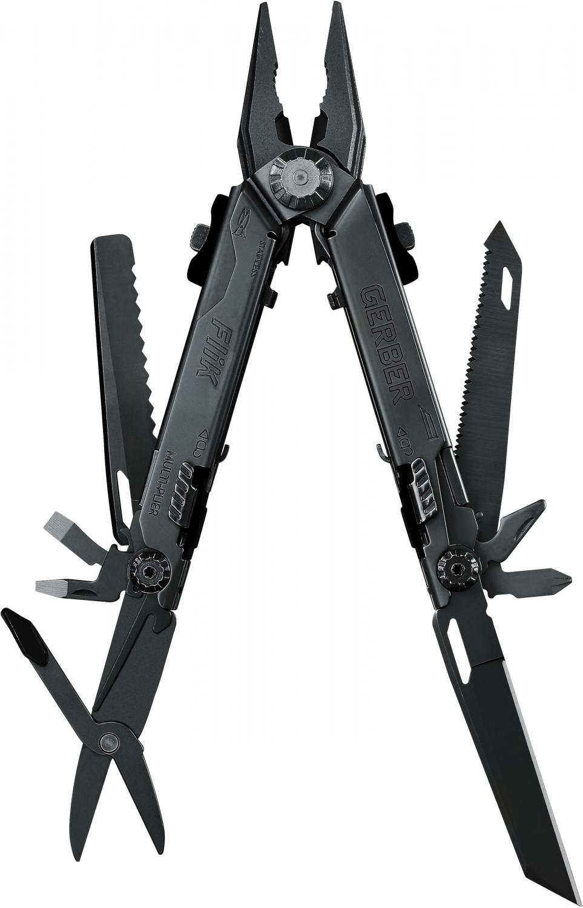

## Main Text
I am curious to see what my little brother Kenai has been doing lately.  It seems he developed a tool [@arnholt_third_2002] that is more sophisticated than my gerber knife shown below.   Kenai did some fantastic facial reconstruction [@lopez_safety_2007] while he was deployed.  Keep up the good work little brother! 

## Notes
If you want to change the citation style langauage (csl) pass a different argument to  `csl` in the YAML.  Different `csl` files for zotero can be downloaded from [https://www.zotero.org/styles](https://www.zotero.org/styles).

# References