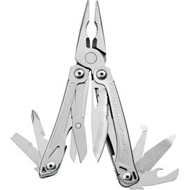

## Main Text
I am curious to see what my little brother Kenai has been doing lately.  It seems he developed a tool [@arnholt_third_2002] that is more sophisticated than my leatherman knife shown below. 

  

Kenai did some fantastic facial reconstruction [@lopez_safety_2007] while he was deployed.  Keep up the good work little brother! 

## Notes
If you want to change the citation style language (csl) pass a different argument to  `csl` in the YAML.  Different `csl` files for zotero can be downloaded from [https://www.zotero.org/styles](https://www.zotero.org/styles).

Make sure your `*.bib` file is in the same folder as your `*.Rmd` or specify the path to your `*.bib` file in the YAML.  The same advice applies to the `csl` file.

## Some Mathematics

Mathematics can be written with standard \LaTeX.  Inline equations are enclosed in between single `$` signs, and display equations are enclosed between double `$$` signs.


#### The limit of a function

$$\lim_{x \to c} f(x) = l \iff \forall \epsilon > 0 \quad \exists \delta > 0 \text{ such that if } 0 < \left|x - c\right| < \delta,  \text{ then } \left|f(x) - l\right| < \epsilon$$


**Simple Integral**

$$\int_{3}^{10} \frac{1}{10}\, dx = 0.7$$


```{r, label = "firstChunk", comment = NA}
a <- 3
b <- 10
f <- function(x){1/10}
answer <- integrate(Vectorize(f), a, b)$value
answer
```

$$\int_{3}^{10} \frac{1}{10}\, dx = `r answer`$$

$$\int_{6}^{10} \frac{1}{10}\, dx = `r integrate(Vectorize(f), 6, 10)$value`$$


**More Challenging Integral?**

$$\int_{85}^{115} \frac{1}{\sqrt{2\pi 15^2}}e^\frac{(x - 100)^2}{2\times 15^2}\, dx = `r pnorm(115, 100, 15) - pnorm(85, 100, 15)`$$

## A Graph?

```{r, label = "Agraph", message = FALSE, fig.align = 'left'}
library(PASWR2)
normarea(85, 115, 100, 15)
```

## Show Session Information

```{r, label = "sessioninfo", comment = NA}
sessionInfo()
```

# References